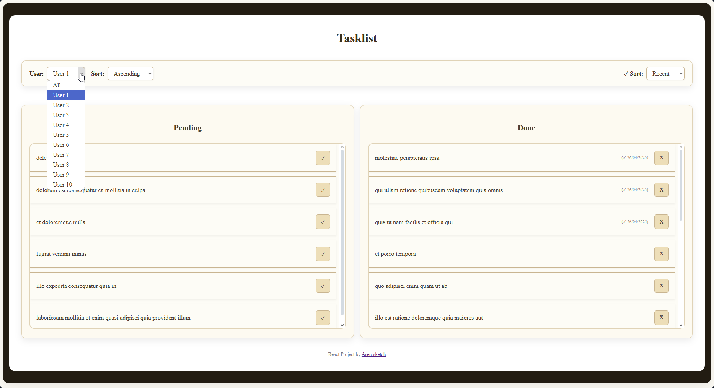

# To-do React Application
### Task: 
Create a Todo app with two main sections: Uncompleted Todos and Completed Todos. The app should have functionality for filtering, sorting, and moving todos between sections.

## Prerequisites

. . .

## Setup

. . .